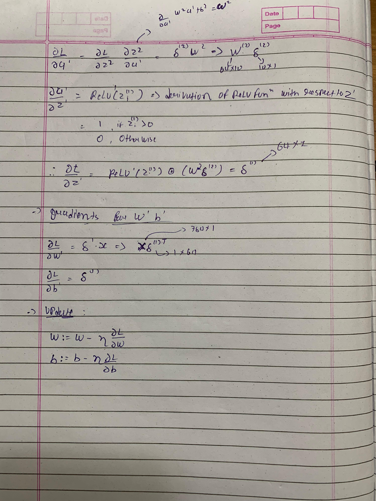
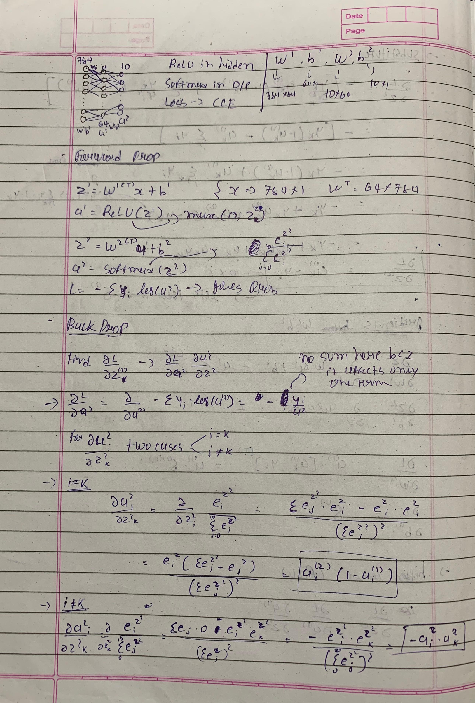
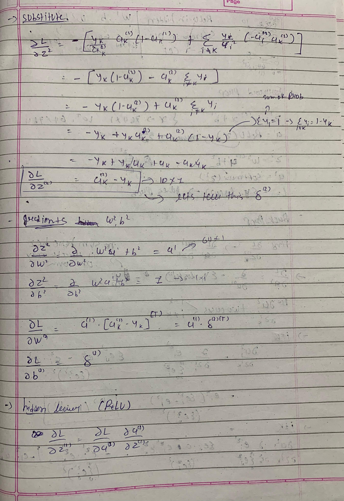

  
  
  

<h1 align="left">🧠 Neural Network from Scratch</h1>

  Built using <b>NumPy</b> and <b>PURE MATHS</b> — no frameworks, no high-level libraries.

## ✨ Overview

This project is a **fully connected neural network** implemented from scratch — no deep learning libraries, just **NumPy** and manually derived math. 

I built this to learn exactly how neural networks work under the hood by understanding and implementing **forward propagation**, **backpropagation**, and **gradient descent** step by step.

---

## 🧮 Architecture

- **Input Layer:** 784 neurons (MNIST 28×28 pixels)
- **Hidden Layer:** 64 neurons with **ReLU**
- **Output Layer:** 10 neurons with **Softmax**
- **Loss:** Categorical Cross-Entropy

---
## 📓Derivation (Screenshots)

## 🧠 Why Build From Scratch?

Learning by building *without* high-level libraries gives deep insight into:
- How gradients and backprop actually work 🔁
- How softmax + cross-entropy connect 🧩
- Where numerical errors happen (and how to fix them) 🧮

---
## 📊 Results

-   Accuracy: <b>84%
    
    

----------

## 🤝 Let’s Connect!

I’d love to hear from others also building from scratch or diving deep into ML fundamentals!

-   📫 [LinkedIn](https://www.linkedin.com/in/het-bhalani-20403b2a8/)
    
-   🐦 [Twitter/X](https://x.com/het_bhalani)
    
-   🦤[Kaggle](https://www.kaggle.com/hetbhalani9)

### Built with Math and Love 💙